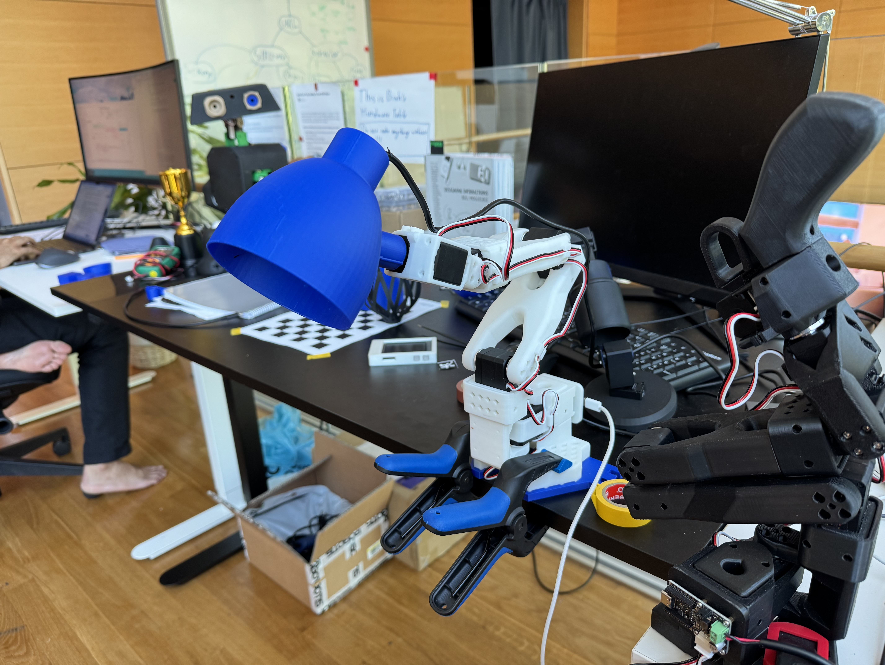
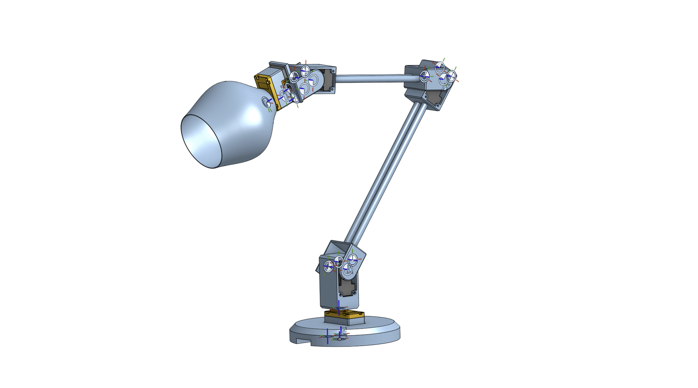

# LeLamp

An open source robot lamp based on [Apple's Elegnt](https://machinelearning.apple.com/research/elegnt-expressive-functional-movement).

**This repository is a early work in progress.** We published our progress early on as we believe early feedback leads to better design iteration. To contribute ideas, you're welcome to join our [Discord](https://discord.com/invite/48pfGZwP).

## Project Overview

LeLamp is being developed on two parallel tracks:

### **1. Modified SO101 Arm**

This version is for those who already own an SO-101 or SO-100 arm from The Robot Studio. We built it for quick prototyping.

3D files for modifications can be found in `prints/modifications_for_so101/`

### **2. From Scratch Design**

Currently in development. This version will be our main model in the future, where we'll build new interactive paradigms and even imitation learning or general policies for real world deployment.

You can view the live CAD model on [OnShape](https://cad.onshape.com/documents/7ff6d1fd85a1383ea9f71557/w/b399d2ceb47c6775362882dc/e/14b04feff73ad1eb6f6b1f57?renderMode=0&uiState=688fc0a88a82666976c1a86f)

## Demo

`main.py` contains a hand tracking demo that uses a PID loop to control the shoulder pan and wrist flex of the arm.

### Running the Demo

1. Install uv: `pip install uv`
2. Run: `uv run main.py`

Note: If you have trouble installing with GitLFS, try running `export GIT_LFS_SKIP_SMUDGE=1`

## Status

This project is actively being developed. Upcoming tasks:

- [ ] Redesign lamp to fit ST3215 servos
- [ ] Test Mujoco environment
- [ ] Train lamp to jump
- [ ] Add voice and mic capabilities

More updates coming in the upcoming weeks!

## License

This project is licensed under the GNU General Public License v3.0 - see the [LICENSE](LICENSE) file for details.
